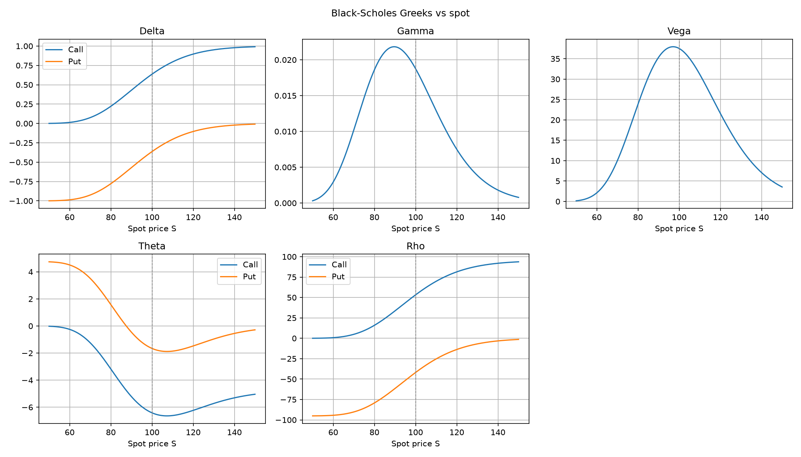

# Black-Scholes Option Pricing

Implementation of the Black-Scholes formula using Python, for European-style options. Includes the closed-form price, the Greeks and a Monte Carlo simulation that converges to the result found via the closed form.

## What's implemented
- **Closed form prices** for European calls and puts on a non-dividend-paying stock, using the Black-Scholes formula and put-call parity.
- **The Greeks**: delta, gamma, vega, theta, rho - each plotted against spot price.
- **Monte Carlo simulation**: Simulates stock prices under the risk-neutral measure and averages the discounted payoff. Can be seen to converge to the closed-form price as the number of simulations increases.
- **Pytest** tests validating option pricing, the Greeks and the Monte Carlo estimation.

## Background

The Black-Scholes price of a European call is

$$
C = S N(d_1) - K e^{-rT} N(d_2)
$$

where

$$
d_1 = \frac{\ln(S/K) + (r + \sigma^2/2)T}{\sigma\sqrt{T}}
$$

$$
d_2 = d_1 - \sigma\sqrt{T}
$$

and $N(\cdot)$ denotes the standard normal cumulative distribution
function.

The Black-Scholes price is the cost of replicating the option's payoff using the stock and a risk-free bond. A portfolio of the stock and the bond that replicates the option's payoff must cost the same as the option, by no-arbitrage.
Equivalently, the price is the discounted expected payoff under the
risk-neutral measure: a set of probabilities under which every asset
grows at the risk-free rate.

## Usage

Install dependencies:

    pip install -r requirements.txt

Run the script:

    python black_scholes.py

## Example output

    Call price (closed form): 10.4506
    Put price  (closed form): 5.5735
    Call price (Monte Carlo): 10.4434 +/- 0.0329

Three plots are written to `output/`:

- `price_vs_spot.png` — call and put prices against spot price
- `greeks.png` — delta, gamma, vega, theta, rho against spot price
- `monte_carlo_convergence.png` — running Monte Carlo estimate
  against number of paths, on a log x-axis

## Tests

    python -m pytest -v

The suite validates:

- The closed-form call and put prices against known values for the
  standard test case (S = 100, K = 100, T = 1, r = 0.05, sigma = 0.2).
- Put-call parity as an exact identity.
- The Greeks against known values, plus no-arbitrage identities
  between them.
- The Monte Carlo estimator against the closed-form price, within
  four standard errors.

## Project structure

    black-scholes/
    ├── black_scholes.py          # prices, Greeks, Monte Carlo, plots
    ├── test_black_scholes.py     # pytest suite
    ├── requirements.txt
    ├── README.md
    ├── .gitignore
    └── output/                   # generated plots

## Implementation

- The Greeks are computed analytically, not by finite differences. Tests validate them against known values for a standard case (S = 100, K = 100, T = 1, r = 0.05, sigma = 0.2).
- The Monte Carlo estimator uses the risk-neutral measure, so the drift is `r`, not the real-world expected return `mu`. Using `mu` would give a different price.
- The convergence plot shows the running mean of the discounted payoff against the number of simulated stocks, illustrating that this converges at a rate proportional to `1/sqrt(N)`.

## Limitations

The Black-Scholes model assumes the market consists of at least one risky asset and one riskless asset, called a bond and a stock respectively. It then makes the following assumptions.

**About the assets:**

- The risk-free rate is constant.
- The stock follows a geometric Brownian motion: the instantaneous
  return has constant drift and constant volatility.
- The stock pays no dividends.

**About the market:**

- No-arbitrage: there is no riskless profit in excess of the
  risk-free rate.
- Frictionless market: no transaction costs, no bid-ask spread.
- Borrowing and lending at the risk-free rate is unlimited.
- The stock can be bought and sold in any quantity, including
  fractional amounts.

Real markets violate several of these, but the model is useful as a
benchmark and a starting point.

## Notes

This was the first project in a series aimed at building a quant
portfolio. Key things I took away:

- This was my first exposure to Black-Scholes. Working through it, I understood for the first time that the formula comes from a model of the stock (geometric Brownian motion) and a derivation (via stochastic calculus).
- I had not encountered the Greeks before either. Working through the formulas and plots helped me understand what each one measures: delta as the option's equivalent stock position, gamma as the curvature of the price with respect to spot, vega as sensitivity to volatility, theta as time decay, and rho as sensitivity to interest rates.
- The distinction between an analytical solution and a numerical one became clear: the closed-form price is exact and fast,
  while the Monte Carlo estimate is approximate and slower, but generalises to models without a closed form. (e.g. I imagine it would not be difficult to generalise the Monte Carlo for a dividend paying stock.)
- Working through the Monte Carlo simulation and the Greeks plots was my first substantial use of Numpy for vectorised computation
  and Matplotlib for multi-panel figures.

## References

- MIT OpenCourseWare, *18.600 Probability and Random Variables*
  (Fall 2019), especially Lecture 36 on call functions and
  Black-Scholes: for the risk-neutral pricing framework and the
  derivation of the closed-form formula.
- Wikipedia, *Black–Scholes model*: for the closed-form pricing
  formula, the derivation, and the definitions of the Greeks.